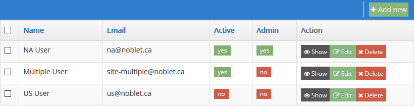
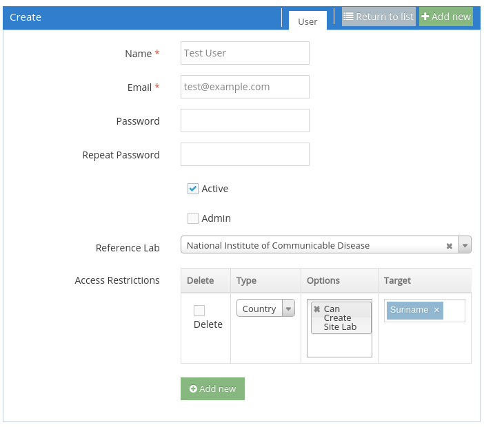
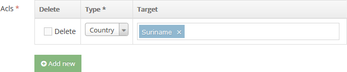

Administration
==============

Access the system Administration page by clicking **Administration** in the sidebar menu and then **Administration** in the sub-menu.

1. All sections
2. User specific
3. Reference lab specific
4. Import Map specific

All sections
------------

The **List**, **Add new**, and **Edit** functions for each section on this page behave similarly, so their commonalities are discussed here. The screenshots show the **User List** as an example.

Click **List** in order to view the list of items in the desired section.

Next to the list is a **Filters** panel that can be used to narrow down the list of items to those matching parameters of your choice.

You can enter partial values in text fields. The result list will include all items where the respective field contains whatever you type here. These fields are not case-sensitive.

The **Advanced** button in the upper-right corner of the **Filters** panel adds controls to text fields with **contains**, **does not contain**, and **is equal to** options.

The currently displayed list of items can be downloaded in json, xml, csv, or xls format using the Download links provided at the bottom of the list.

###Adding and editing items

A new item can be added by clicking the **Add new** button in the appropriate section of the **Administration** page, the upper-right corner of the corresponding list page, or the upper-right corner of any corresponding **Create** or **Edit** page.

Items are edited by clicking their respective **Edit** buttons in the **Actions** column of the list page.

The field entry areas of **Create** and **Edit** pages are the same, and allow you to enter information related to the item.

To leave the **Create** or **Edit** page without saving changes, click the **Return to list** button in the upper-right corner.

On the **Create** page, the buttons below the item information are as shown below. When adding multiple items, it is convenient to use the **Create and add another** button in order to avoid going back to the list after each one.

On the **Edit** page, the following buttons are displayed below the item information. **Update** saves the item information and remains on the **Edit** page, while **Update and close** saves the information and returns to the list page. The **Delete** button deletes the item after asking for confirmation.

###Deleting items

Note that **Country**, **Site**, and **User** items have an **Active** checkbox. These items cannot be deleted if there still exist case records with references to them, so the ability to deactivate them allows their use to be discontinued for future case records.

Items can be deleted individually by clicking the item's **Delete** button in the **Action** column of the list page or the **Delete** button below the item information in the **Edit** page.

Items can be deleted in bulk by selecting the checkboxes next to their names in the list page, selecting the **Delete** action at the bottom of the page, and clicking **OK**.

**CAUTION:** Enabling the **All elements** checkbox at the bottom of the list will apply the **Delete** command to **all** items in the section, *including those that are not currently visible due to filtering or pagination.*

User Specific
-------------

###Acls

The **Acls** section of the **Create** or **Edit** user page can be used to limit user access to specific categories of cases or the ability to import and export data for specific areas. The **Add new** button below the Acls list is used to create one or more Acls that apply to the user.

Use the **Type** drop-down to select a category on which to limit access. Then begin typing the specific criterion under **Target**. Matching criteria from the relevant internal list will be offered as autocomplete suggestions.

Logically, each Acl should be thought of as an *allow only* limitation. To allow access to multiple specific criteria in a given category, add additional Acls.

**Acls** can be deleted by enabling the **Delete** checkbox next to them and then saving the user information with a **Create** or **Update** button.

Reference Labs Specific
-----------------------

You can select multiple countries in the **Countries** drop-down list. Select one at a time, then click in the field again to select another. Click the **x** next to any country that you want to remove from the field.

Import Maps Specific
--------------------

Please refer to import.md for full documentation of import/export functions.
