Entrada y modificación de casos
====================

1. [Búsqueda y listado de casos](#búsqueda-y-listado-de-casos)
2. [Crear Casos](#creación-de-casos)
3. [Modificar casos](#modificación-de-casos)
4. [Eliminar casos](#eliminar-casos)
5. [Notificación negativa](#notificación-negativa)
6. [Reportes](#reportes)

Búsqueda y listado de casos
-------------------------

Para mostrar un listado de casos, hacer clic en **Entrada de Datos** en el menú de despliegue a la izquierda y luego en 
**NMB** o **Rotavirus**.

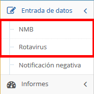

La página de **Casos Recientes** aparece, con el panel de entrada de casos **Crear/Editar** Caso y el panel de **Filtros**.

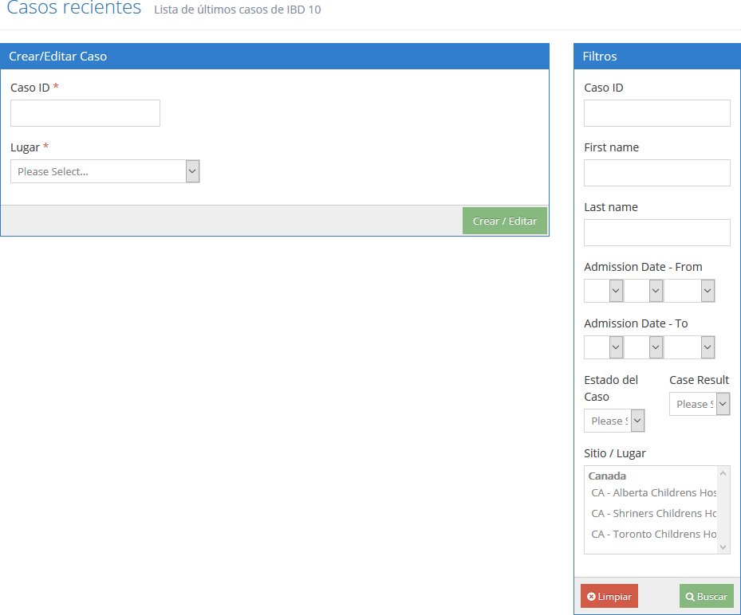

Entrar o seleccionar o ingresar los criterios para buscar casos en el panel de **Flitros** al lado derecho de la página.

En el panel de resultados se muestran los casos que cumplen con los criterios ingresados en el filtro. Se pueden ingresar 
números parciales para el **Case ID**.  Estos campos no distinguen entre mayúsculas y minúsculas.

En los campos de **País y Sitio/Lugar**, se puede seleccionar múltiples valores manteniendo pulsada la tecla CTRL y haciendo 
clic en múltiples selecciones o valores.  La lista de resultados incluye los casos que coinciden con los criterios seleccionados.

Los campos de **País y Sitios/Lugar** solo aparecen si el usuario se ha configurado para tener acceso para visualizar varios 
sitios o países. Por ejemplo, si la cuenta del usuario tiene acceso a un solo país, en el panel de **Flitros** no mostrará 
opciones de países.
 
Para ver los últimos casos recientes dejar en blanco los campos o sin seleccionar y hacer un clic en **Buscar**. La página 
se refresca y la lista de casos se muestra en el panel de lista de casos.  Los casos están listados en orden descendiente 
de creación de caso. Ejemplo, el caso más reciente estará en la parte superior y solo se mostraran los casos que la cuenta 
de usuario tiene acceso.

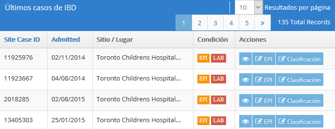

Cualquier filtro que se aplique esta en efecto cuando se crean o editan los casos. Para **limpiar** los filtros se debe 
hacer clic en Limpiar en el panel de **Filtros**. 

### Botones de Acción

Los Botones de **Acción** se muestran en la columna de **Acciones**.

Para ver los detalles de un caso específico de la lista, hacer clic en **Visualizar** o botón que muestra un ojo.

Para editar los detalles epidemiológicos  hacer clic en icono de editar **EPI** caso. Para editar la clasificación hacer 
clic de editar **Clasificación**.

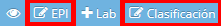

Note que si la pantalla del navegador es angosta, en la barra de los botones de Acciones se muestra solo un botón con 
icono de engranaje. Hacer clic en el botón de engranaje para ver todos los botones de acción. Los botones de Acción también 
aparecen en el rincón derecho de la parte superior de las páginas para mostrar y editar casos. 

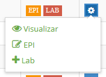

En esta barra de botones se muestra un botón **Listar** para regresar a la lista de los casos.

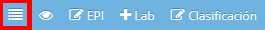

El perfil de permisos de la cuenta del usuario determina que botones se muestran en la columna de **Acciones**.  

Los botones adicionales en la barran de botones se muestran con iconos para agregar o editar dependiendo si el detalle 
del registro ya existe.
  
Al hacer clic en los botones para agregar o editar en la columna de **Acciones**, éste lo lleva a una página de edición 
para el detalle de registro seleccionado del caso.

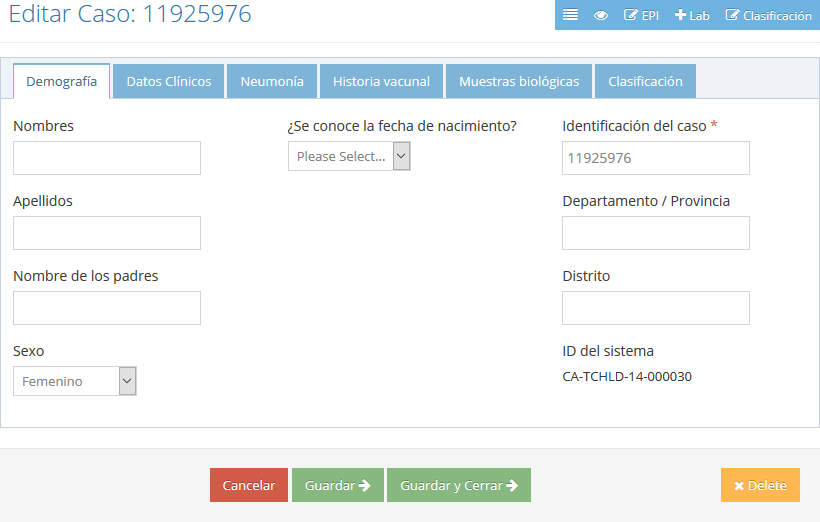

Para más información de la edición de casos.  Ver en la sección de **Modificación de Casos** abajo.

### Indicadores de completitud de Casos

En la columna de **Estado**, se muestran **EPI** y **LAB** en verde, naranja o rojo. El verde indica que los detalles del módulo 
EPI o LAB tienen los datos completos y que han pasado la validación de errores. El naranja indica que los datos están 
incompletos. El rojo indica que el registro no se ha creado o que hay errores en los datos.

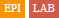

Creación de casos
--------------

Los casos de IBD y Rotavirus son creados desde la página de **Casos Recientes**, que se describe en la sección de 
 [Búsqueda y listado de casos](#búsqueda-y-listado-de-casos).

1. En el panel de **Crear Caso**, ingresar el **Case ID**.

   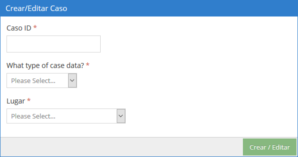

2. Las opciones en el desplegable **Que tipo de datos de caso?** dependen de los permisos de acceso de cada usuario. Ejemplo, 
si la única opción que se tiene es Caso, seleccione para entrar un nuevo caso.  

   Si los permisos de la cuenta lo permite, se puede desplegar opciones como **Caso Laboratorio Local, RRL** 
   (Laboratorio Regional de Referencia), o **NL** (Laboratorio Nacional). Si, selecciona uno de estas opciones y hace un clic 
   en el botón **Crear/Editar** usted es llevado a la página de los detalles de edición laboratorio.
  
3. En la lista desplegable **Lugar**, seleccionar el sitio en que el caso es notificado o asociado,

4. Hacer clic en **Crear/Editar**.

Sera llevado a la página de edición de casos  donde se puede ingresar los detalles del caso.

Modificación de casos
---------------

Si sabe el CaseID y Lugar del caso que quiere modificar, puede ir directamente a la página de edición de casos, 
siguiendo el mismo procedimiento que se describió en la sección de [Creación de casos](#creación-de-casos). También puede 
localizar el caso en la lista de **Casos Recientes** y usar los botones de la columna de Acciones , como se describe en 
la sección de **Botones de Acción**.

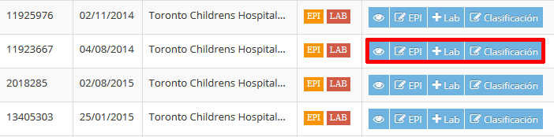

### Agregar o editar detalles de laboratorio

Los botones de **Crear Lab** o **Editar Lab** aparecen en la columna de **Acciones** si la cuenta de usuario tiene permisos 
para crear o editar los detalles de laboratorio. Los botones de **Crear LRR** y **Crear NL** aparecen si la cuenta de usuario 
tiene permisos para crear o editar detalles del laboratorio de Referencia Regional o detalles del laboratorio Nacional 
de Referencia, respectivamente. También Las preguntas **Se envió al LRR** o **Se envió al Laboratorio Nacional** se activará 
en los detalles de Laboratorio. Al hacer clic en los botones de Crear o Editar lo lleva a la página de edición de los detalles 
de laboratorio del registro de caso.

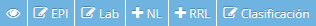

Eliminar Casos
==============

Para eliminar casos, encuentre el caso en la lista de  Casos Recientes como se [describió anteriormente](#búsqueda-y-listado-de-casos) 
y hacer clic en botón de editar EPI. Cuando el caso se muestra, hacer clic en el botón **Eliminar**.

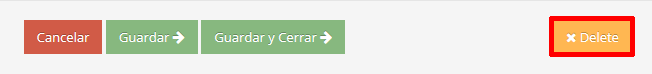

Un dialogo de confirmación aparecerá. Hacer Clic en **OK** para eliminar el caso.

Notificación Negativa
==============

En el reporte de **Rendimiento del Sitio** la columna de **informes consistentes** muestra, si el sitio reportó 
consistentemente y los meses en se reportó del total de meses. Para esto se debe notificar al sistema por los meses en 
que no hay reporte de casos. No reporte de casos en un mes indica que el número de casos reportados en el mes es cero. 
O que el número de casos no fue reportado.

Hacer clic en **Entrada de Datos** y luego en **Notificacion Negativa** en el menú del lado izquierdo.

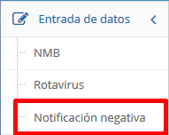

Seleccionar el **Tipo** de caso (NMB o Rotavirus) y el rango de fechas, luego hacer clic en Submit.

Note que seleccionar un rango de fechas muy largo puede ocasionar que la tabla sea muy ancha y que no se muestre 
visualmente bien en la ventana del navegador. 

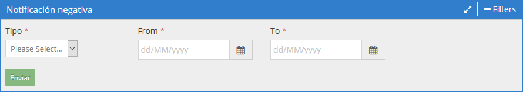

Una lista de sitios se presenta con un número de casos por cada mes. Cuando el número de casos para un sitio es cero en 
un mes determinado se muestra una caja de despliegue con una lista de opciones **Cero** y **No reporta**. 

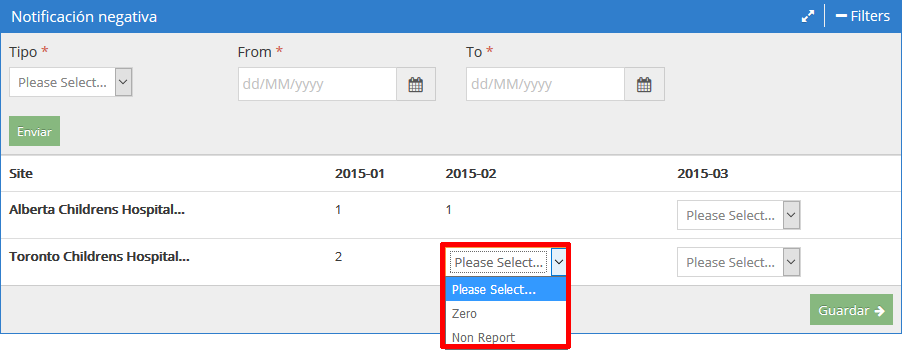

En cada caja de lista de desplegable seleccionar **Cero**, si el número de casos por el mes es cero o seleccionar **No Reporta** 
si el número de casos no se reporta. Hacer clic en el botón **Grabar** cuando termina. Y luego se mostrara una notificación 
de actualización con éxito.

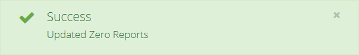

Note que no es necesario seleccionar todas cajas de despliegue. Los actualizaciones se grabaran y puede regresar luego 
para hacer selecciones adicionales..

Reportes
=======

Para ver reportes, hacer clic en **Reportes** en el menú de la izquierda, y luego hacer clic en **NMB** o **Rota**, y luego hacer 
clic en el reporte que desee ver. 

En el encabezado de los reportes hay botones para **Maximizar** and **Filtros**.

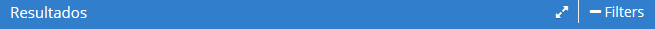

El botón de **Maximizar** expande el reporte para ocupar toda la ventana del navegador para ver el reportes facilmente. 
Hacer un clic otra vez en el botón para regresar a su tamaño normal. 

El botón de **Filtros** muestra el panel de filtros para limitar los resultados de acuerdo a los parámetros que se escogen. 
También se incluye un botón de **Exportar** que le permite bajar los resultados que se muestran en archivos Microsoft Excel 
(.xls). Hacer clic en el botón de **Filtros** otra vez para colapsar el panel de filtros.

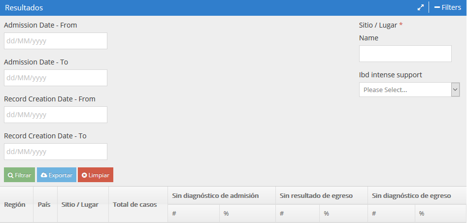

