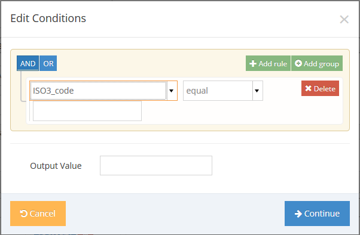

Map Building
===========
1. Build map via file upload
2. Pre-Processors
3. DB Column
4. Validators
5. Drop
6. Reasons for skips or warnings

Build map via file upload
-------------------------

The most common way to build a map will likely be uploading a sample file. The system will read the header column row and build an initial map. It will try to match any column name in the file with database columns.

When creating a new map the following fields are available: *name, notes, class, version, headerRow, caseLinker, labPreference, file*.

###Lab Preference Field

The lab preference, and file upload fields are only available on new map creation. The lab preference field is used only when the map creation receives a file. The purpose of the field is to tell the system what kind of serotype data to link to. The reason for this is that the fields in a national lab result are identical to those in a reference lab. Thus this field tells the map builder to select by default one over the other when it finds matching field names.

###Name, Class & Version Fields

Everywhere else in the system the map will be referred to through the combination of the name, class and version fields. For example if you create a map with name EMR EPI, class IBD and version 1, the map will be selectable for import with the text field *'EMR EPI (IBD 1)'*. The notes field is useful for administrators that need or want to leave some comments about the particular mapping's existence. So as a naming convention, there is no need to write the type of import in either the name or version fields as it will be included by virtue of the map class field. The version field is also free form text, so could contain small version differences. Suppose you had two files from a region for whatever reason, or need to deal with a historical file. The version field might be where you could put the year or something like 'missing X'. Thus you could get a map named 'EMR EPI (IBD 2013-Missing DOB) for example.

###Header Row Field

This tells the map builder which row of the source file contains the column names. All rows before this row will be ignored.

###Case Linker Field

The case linker field determines how the data gets linked to a particular case. The two choices are **Case Id and Site Code** and **Case Id and Verify Country**. The Case Id and Site Code will require that the file has the case id field and the site code. When importing for each row the system will use the two fields in a few ways. Within the file itself it will skip any rows after the first detected unique combination of case Id and site. For example a file that contains the following data...

```
case_ID,site,adm_date,...
1234,AGO-1,2014-01-01,...
3223,AGO-1,2014-02-15,...
1234,AGO-1,2014-01-03,...
...
```

...would import the first and second rows and skip the third one, it would however notify you of a detected duplicate so you could investigate if it truly is a duplicate.

The two fields are also used to find pre-existing cases to update. So using the same data example above. If case 1234, AGO-1 already exists in the database, a new record isn't created, but the existing record is retrieved and any fields in the file are updated.

The second option is the 'Case Id and Verify Country' option. This is designed primarily to handle importing RRL data that doesn't contain a proper site id. This linker will look for a case with the particular case id within a single country. If there is more than one it will not import the data. This makes the assumption that in the surveillance network case id generation is at least unique within each country.

Pre-Processors
--------------

Each column to be imported can have an associated **Pre-Processor** with one or more conditions to handle situations where the data in the import file is not an exact match to what should be entered in the case record. Pre-Processors can be fairly complex and are therefore quite flexible.



Rules and rule groups can be added and combined with AND and OR operators. The values of multiple input fields can be evaluated to determine the value to output to the case record.

Once a Pre-Processor has been attached to a column, you will see **Modify** and **Delete** buttons for editing or removing the pre-processor.

DB Column
---------

**DB Column** is the field in the case data to which the imported column data should be assigned. The selectable options are displayed as internal field names and types. It is not necessary to scroll through all the options; you can type any part of the desired option and matching options will be displayed as autocomplete values.

Validators
----------

**Validators** ensure that the data imported into the case is correctly formatted and within accepted ranges. Warnings will be generated for validation failures during import and the field will be output to the case record as the OUT\_OF\_RANGE constant of -9999.

Drop
----

Enable the **Drop** checkbox for any column that is unrelated to the core data variables or if the data in that column should not be imported into the case record for any reason. Values in a dropped column can still be used in pre-processors.

Reasons for skips or warnings
-----------------------------

The combination of Case Id and Site Code uniquely identify a case. As described above in the **Case Linker Field** section, if the import process finds a row where the Case Id and Site Code combination has already been found earlier in the imported file, the row will be skipped. When using **Case Id and Verify Country**, it is assumed that Case Id is unique within a Country; therefore, additional rows with the same Case Id within a country will be skipped. Skipped rows are noted in the output of the import process.

Warnings will be generated on rows in the import file where field validation fails. Data for the row is still imported, but the field where validation failed will be set to the OUT\_OF\_RANGE constant of -9999.

Importing
=========

To import a data file or view the results of recent imports, click **Imports & Exports** on the sidebar menu and then **Import Data Files**.


To import a file:

1. Select the import **Map** that matches the format of the data file.

2. Select the appropriate **Reference lab** if the file contains Reference lab data.

3. Select a date range for import. Note that data outside this range will still be imported, but warnings will be generated.

4. Click the **Source file** field to browse and select the file to upload.

5. Click the **Import** button.

Interpreting output
-------------------

How to read outputs (warnings,errors,successes)
