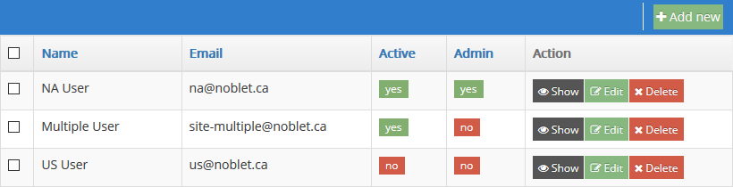
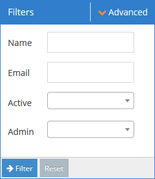
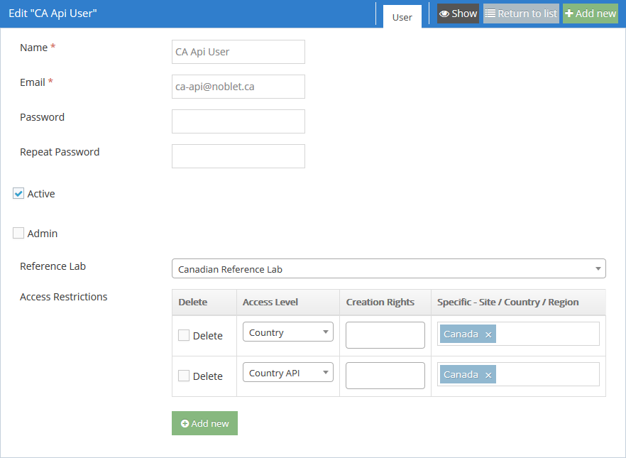
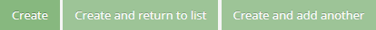
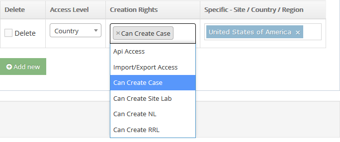

Administration
==============

Access the system Administration page by clicking **Administration** in the sidebar menu and then
**Administration** in the sub-menu.

1. [All sections](#all-sections)
2. [User specific](#user-specific)
3. [Reference lab specific](#reference-lab-specific)
4. [Import Map specific](#import-map-specific)

All sections
------------

The **List**, **Add new**, and **Edit** functions for each section on this page behave similarly, so
their commonalities are discussed here. The screenshots show the **User List** as an example.

Click **List** in order to view the list of items in the desired section.

Next to the list is a **Filters** panel that can be used to narrow down the list of items to those
matching parameters of your choice.

You can enter partial values in text fields. The result list will include all items where the
respective field contains whatever you type here. These fields are not case-sensitive.

The **Advanced** button in the upper-right corner of the **Filters** panel adds controls to text
fields with **contains**, **does not contain**, and **is equal to** options for further refining the
search.

The currently displayed list of items can be downloaded in json, xml, csv, or xls format using the
Download links provided at the bottom of the list.

### Adding and editing items

A new item can be added by clicking the **Add new** button in the appropriate section of the
**Administration** page, the upper-right corner of the corresponding list page, or the upper-right
corner of any corresponding **Create** or **Edit** page.

Items are edited by clicking their respective **Edit** buttons in the **Actions** column of the list
page.

The field entry areas of **Create** and **Edit** pages are the same, and allow you to enter
information related to the item.

To leave the **Create** or **Edit** page without saving changes, click the **Return to list** button
in the upper-right corner. In order to prevent accidental loss of changes, a prompt will appear,
asking whether you really want to leave the current page or stay on it. The **Show** and **Add new**
buttons next to the **Return to list** button also interrupt the editing process and therefore
display the same confirmation prompt.

On the **Create** page, the buttons below the item information are as shown below. When adding
multiple items, it is convenient to use the **Create and add another** button in order to avoid
going back to the list after each one.

On the **Edit** page, the following buttons are displayed below the item information. **Update**
saves the item information and remains on the **Edit** page, while **Update and close** saves the
information and returns to the list page. The **Delete** button deletes the item after asking for
confirmation.

### Deleting items

Note that **Country**, **Site**, and **User** items have an **Active** checkbox. These items cannot
be deleted if there still exist case records with references to them, so the ability to deactivate
them allows their use to be discontinued for future case records.

Items can be deleted individually by clicking the item's **Delete** button in the **Action** column
of the list page or the **Delete** button below the item information in the **Edit** page.

Items can be deleted in bulk by selecting the checkboxes next to their names in the list page,
selecting the **Delete** action at the bottom of the page, and clicking **OK**.

**CAUTION:** Enabling the All elements checkbox at the bottom of the list will apply the Delete
command to all items in the section, *including those that are not currently visible due to
filtering or pagination.*

User Specific
-------------

### Access Restrictions

The **Access Restrictions** section of the **Create** or **Edit** user page can be used to limit
user access to specific categories of cases or the ability to import and export data for specific
areas. The **Add new** button below the Access Restrictions list is used to create one or more
restrictions that apply to the user.

Use the **Access Level** drop-down to select a category on which to limit access.

Click the **Creation Rights** field to select one or more actions that the user will be allowed to
perform on the item that you will select in the **Specific - Site /Country /Region** field. An
option you have already added can be removed if necessary by clicking the **x** next to it. Leaving
the **Creation Rights** field empty will give the user view-only access to the **Specific - Site / Country / Region** 
selected.

Begin typing the specific criterion under **Specific - Site / Country / Region**. Matching criteria
from the relevant internal list will be offered as autocomplete suggestions.

Logically, each Access Restriction should be thought of as an *allow only* limitation. To allow
access to multiple specific criteria in a given category, add additional restrictions.

An Access Restriction can be deleted by enabling the **Delete** checkbox next to it and then
saving the user information with the **Create** or **Update** button.

### Administrator User Types

There are three levels of administrator users: **Super Administrators**, **Regional
Administrators**, and **Country Administrators**.

As shown below, **Super Administrator** users have no access restrictions, but cannot see case data.
This role is primarily intended to allow IT staff to create Regional and Country Administrator
users. Super Administrators can administer the entire system, including Regions, Countries, Sites,
Reference Labs, all Users, API Clients, Remotely Authorized Clients, and all Maps.

The initial Super Administrator user is created during the installation process. To create another
Super Administrator, enable the **Admin** checkbox on the user create/edit page and do not add any
Access Restrictions.

---

As shown below, **Regional Administrator** users can only access their assigned Region and the
Countries, Sites, Reference Labs, and Users within it. They also have access to all Maps.

To create a Regional Administrator, enable the **Admin** checkbox on the user create/edit page and
add an Access Restriction to limit access to the appropriate Region.

---

As shown below, **Country Administrator** users can only access their assigned Country and the Sites
and Users within it.

To create a Country Administrator, enable the **Admin** checkbox on the user create/edit page and
add an Access Restriction to limit access to the appropriate Country.

Reference Lab Specific
----------------------

You can select multiple countries in the **Countries** drop-down list. Select one at a time, then
click in the field again to select another. Click the **x** next to any country that you want to
remove from the field.

Import Map Specific
-------------------

Please refer to [import.md](import.md) for full documentation of import/export functions.
