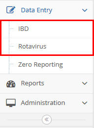
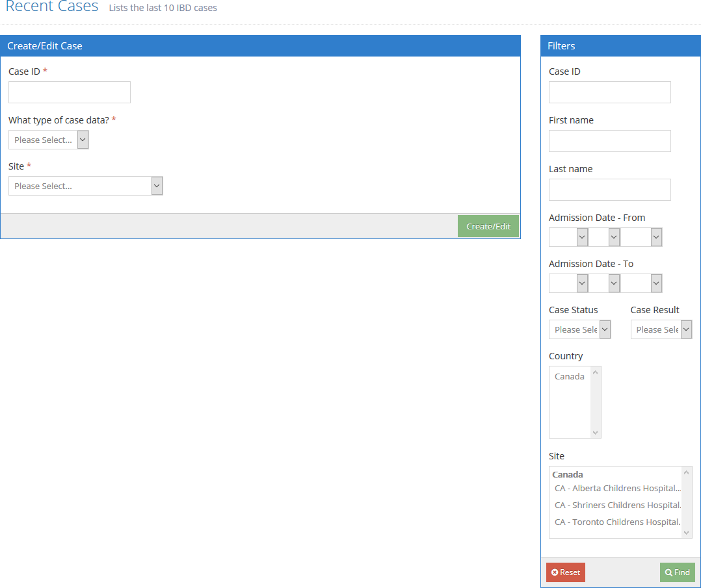
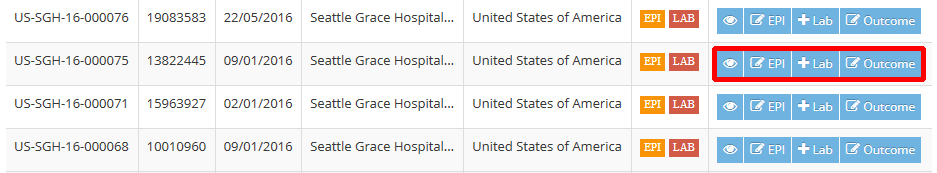
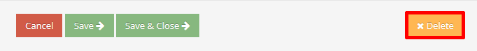
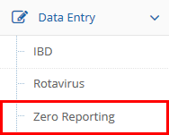
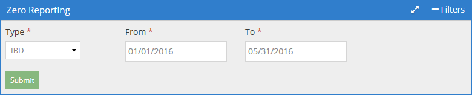
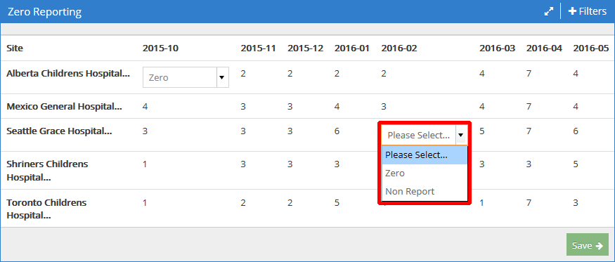
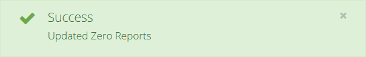

Cases and Data Entry
====================

1. [Finding and listing cases](#finding-and-listing-cases)
2. [Creating cases](#creating-cases)
3. [Modifying cases](#modifying-cases)
4. [Deleting cases](#deleting-cases)
5. [Zero Reporting](#zero-reporting)
6. [Reports](#reports)

Finding and listing Cases
-------------------------

To view the list of cases, click **Data Entry** on the sidebar menu, and then **IBD** or
**Rotavirus**.

The **Recent Cases** page will be displayed, showing **Create/Edit Case** and **Filters** panes.

Enter or select the criteria for cases you want to see in the **Filters** panel on the right side
of the page. The result list will include all cases where the respective field contains whatever you
type here. You can enter a partial value for **Case ID**.  These fields are not case-sensitive.

In the **Region**, **Country**, and **Site** fields, you can hold down `CTRL` and click to select
multiple values. The result list will include results that match any of the selected values. Note
that each of these fields only appears in the **Filters** panel if your user account has been
administratively configured to allow access to cases with multiple possible values for that field;
for example, if your account is restricted to cases in a particular country, the ability to filter
on country would be irrelevant, so the Country field is not displayed.

You can view all recent cases by leaving all the filter fields blank or unselected.

Click **Find** when you are ready to proceed. The page will refresh and the list of matching cases
will be displayed. Cases are listed in descending order of creation; i.e. newest cases at the top.
Only cases that your user account has permission to access are included in the Recent Cases list.

Any filters you apply remain in effect throughout case creation and editing operations. To clear the
filters, click the **Reset** button in the **Filters** panel.

### Actions buttons

Actions buttons are displayed in the **Actions** column. To view the details of a specific case in
the list, click the **View** (eye) button. To edit the case's epidemiology details or outcome, click
the **Edit EPI** button or **Edit Outcome**, respectively.

Note that if your browser screen is narrow, the Actions buttons may be combined into a single gear
button. Click the gear button in order to see all the Actions buttons.

Actions buttons also appear in the upper-right corner of case View and Edit pages. A **List** button
is included here for returning to the cases list.

Your account permissions determine which other buttons, if any, are displayed in the **Actions**
column. These additional buttons are displayed as either Add or Edit buttons, depending on whether
or not the relevant detail record already exists.

Clicking an Add or Edit button in the **Actions** column takes you to an editing page for the
indicated detail record of the case.

For more information on editing a case, see the **Modifying cases** section below.

### Case completion flags

The **Status** column displays green, orange, or red **EPI** and **LAB** flags. A green flag
indicates that the associated epidemiology or lab details are complete and have passed error checks.
An orange flag indicates that data is incomplete. A red flag indicates that the detail record is not
present or an error has been found.

Creating cases
--------------

IDB and Rotavirus cases are created from the **Recent Cases** page, which is accessed as described
under [Finding and listing cases](#finding-and-listing-cases).

1. In the **Create Case** pane, enter the **Case ID**.

   

3. The options included in the **What type of case data?** drop-down list depend on your user
account permissions. If **Case** is the only option displayed, select it.
  
   If your user account permissions allow it, you may also see **Site Lab**, **RRL** (Regional
   Reference Lab), or **NL** (National Lab) options. If you select one of these options, you will be
   taken directly to the lab details editing page after you click the **Create/Edit** button. Lab
   details can also be added later.

4. In the **Site** drop-down list, select the site with which the case is associated.

5. Click **Create/Edit**.

You will be taken to the case editing page where you can enter the details of the case.

Modifying cases
---------------

If you know the Case ID and Site of the case you want to modify, you can go directly to the case
editing page by the same procedure as described above in the [Creating cases](#creating-cases)
section. Otherwise, locate the case in the Recent Cases list and use the buttons in the **Actions**
column, as described in **Recent Cases list: Actions buttons** above.

### Adding or editing lab details

The **Add Lab** or **Edit Lab** button appears in the **Actions** column if your user account has
permission to add and edit Site Lab details. The **Add RRL** and **Add NL** buttons appear if you
have permission to add and edit Regional Reference Lab or National Lab details, respectively, *and*
the relevant **Sent To Reference Lab** or **Sent To National Lab** setting has been turned on in the
Site Lab details. Clicking an Add or Edit button takes you to the editing page for the relevant
detail record of the case.

Deleting Cases
==============

To delete a case, find it in the Recent Cases list as [described above](#finding-and-listing-cases)
and click on its EPI edit button. When the case is displayed, click the **Delete** button below the
details.

A confirmation dialog will be displayed. Click **OK** to delete the case.

Zero Reporting
==============

In order for the **Consistent Reporting** column in **Site Performance** reports to be accurate, it
is necessary to tell the system what happened for months with no reports. No reports in a month can
indicate either that the number of cases *was* reported and the number was zero, or that the number
of cases *was not* reported.

Click **Data Entry** and then **Zero Reporting** on the sidebar menu.

Select the desired **Type** of case (IBD or RotaVirus) and a range of dates, then click **Submit**.

Note that selecting a large date range may cause the table to overflow the right side of the browser
window and not be displayed neatly.

A list of Sites will be displayed, along with case counts for each month in the selected range.
Wherever the number of cases for a site is zero for a given month, a drop-down selector is displayed
with **Zero** and **Non Report** options available.

In each drop-down, select **Zero** if the case count for that month was reported as zero or **Non
Report** if the case count for that month was not reported. Click the **Save** button when you are
finished. A success notification should be displayed.

Note that it is not necessary to select an option for every drop-down displayed. Selections you have
made will be saved and you can return to this area later to make additional selections.

Reports
=======

To view reports, click **Reports** on the sidebar menu, then **IBD** or **Rota**, and then the name
of the report you wish to see.

The report Results header includes **Maximize** and **Filters** buttons.

The **Maximize** button expands the report to occupy your full browser window in order to make
viewing crowded reports easier. Click it again to return to normal size.

The **Filters** button displays a filter panel that allows you to limit results to parameters of
your choice. It also includes an **Export** button that allows you to download the currently
displayed results as a Microsoft Excel (.xls) file. Click the **Filters** button again to collapse
the Filters pane.

