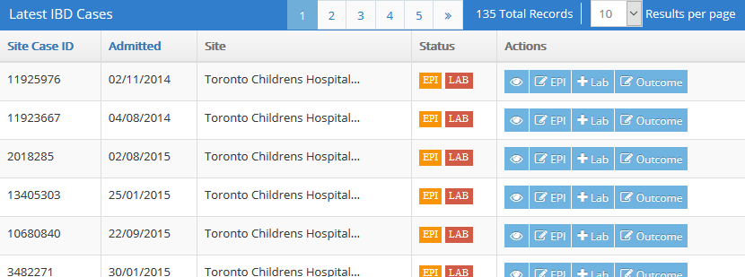
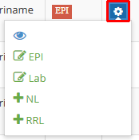
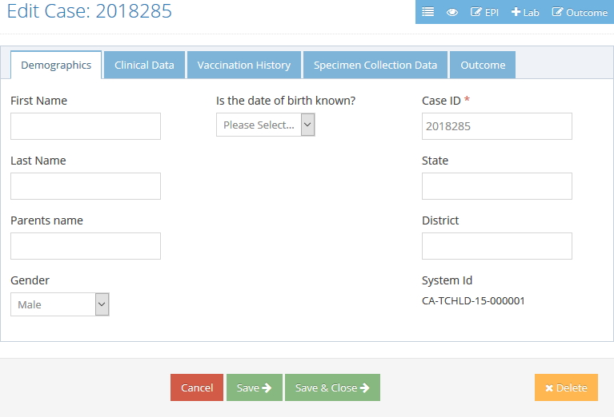

Cases and Data Entry
====================

Recent Cases list
-----------------

To view the list of cases, click **Data Entry** on the sidebar menu, and then **IBD** or
**Rotavirus**. Cases are listed in descending order of creation; i.e. newest cases at the top. Only
cases that your user account has permission to access are included in the Recent Cases list.

###Actions buttons

Actions buttons are displayed in the **Actions** column. To view the details of a specific case in
the list, click the **View** (eye) button. To edit the case's epidemiology details or outcome, click
the **Edit EPI** button or **Edit Outcome**, respectively.

Your account permissions determine which other buttons, if any, are displayed in the **Actions**
column. These additional buttons are displayed as either Add or Edit buttons, depending on whether
or not the relevant detail record already exists. Clicking an Add or Edit button in the **Actions**
column takes you to an editing page for the indicated detail record of the case. For more
information, see the **Modifying cases** section below.

Note that if your browser screen is narrow, the Actions buttons may be combined into a single gear
button. Click the gear button in order to see all the Actions buttons.

Actions buttons also appear in the upper-right corner of case editing pages. A **List** button is
included here for returning to the cases list.

###Case completion flags

The **Status** column displays green, orange, or red **EPI** and **LAB** flags. A green flag
indicates that the associated epidemiology or lab details are complete and have passed error checks.
An orange flag indicates that data is incomplete. A red flag indicates that the detail record is not
present or an error has been found.

Finding cases
-------------

To find a specific case, enter or select criteria in the **Filters** panel to the right of the
Recent Cases list and click **Find**. The list will be refreshed, showing only cases that match your
filter criteria.

You can enter partial values for **System ID** and **Case ID**. The result list will include all
cases where the respective field contains whatever you type here. These fields are not case-
sensitive.

In the **Region**, **Country**, and **Site** fields, you can hold down `CTRL` and click to select
multiple values. The result list will include results that match any of the selected values. Note
that each of these fields only appears in the **Filters** panel if your user account has been
administratively configured to allow access to cases with multiple possible values for that field;
for example, if your account is restricted to cases in a particular country, the ability to filter
on country would be irrelevant, so the Country field is not displayed.

Any filters you apply remain in effect throughout case creation and editing operations. To clear the
filters and return to the full list of cases, click the **Reset** button in the **Filters** panel.

Creating cases
--------------

IDB and Rotavirus cases are created via their respective entries on the **Data Entry** item on the
sidebar menu.

1. Click the green **Create/Edit** button above the Recent Cases list.

2. In the **Create Case** pop-up dialog, enter the **Case ID**.

   

3. The options included in the **Type** drop-down list depend on your user account permissions. If
**Case** is the only option displayed, select it.
  
   If your user account permissions allow it, you may also see **Site Lab**, **RRL** (Regional
   Reference Lab), or **NL** (National Lab) options. If you select one of these options, you will be
   taken directly to the lab details editing page. Lab details can also be added later.

4. In the **Site** drop-down list, select the site with which the case is associated.

5. Click **Create/Edit**.

You will be taken to the case editing page where you can enter the details of the case.

Modifying cases
---------------

If you know the Case ID and Site of the case you want to modify, you can go directly to the case
editing page by the same procedure as described above in the *Creating cases* section. Otherwise,
locate the case in the Recent Cases list and use the buttons in the **Actions** column, as described
in **Recent Cases list: Actions buttons** above.

###Adding or editing lab details

The **Add Lab** or **Edit Lab** button appears in the **Actions** column if your user account has
permission to add and edit Site Lab details. The **Add RRL** and **Add NL** buttons appear if you
have permission to add and edit Regional Reference Lab or National Lab details, respectively, *and*
the relevant **Sent To Reference Lab** or **Sent To National Lab** setting has been turned on in the
Site Lab details. Clicking an Add or Edit button takes you to the editing page for the relevant
detail record of the case.

Reports
=======

To view reports, click **Reports** on the sidebar menu, then **IBD** or **Rota**, and then the name
of the report you wish to see.

The report Results header includes **Maximize** and **Filters** buttons.

The **Maximize** button expands the report to occupy your full browser window in order to make
viewing crowded reports easier. Click it again to return to normal size.

The **Filters** button displays a filter panel that allows you to limit results to parameters of
your choice. It also includes an **Export** button that allows you to download the currently
displayed results as a Microsoft Excel (.xls) file. Click the **Filters** button again to collapse
the Filters pane.

